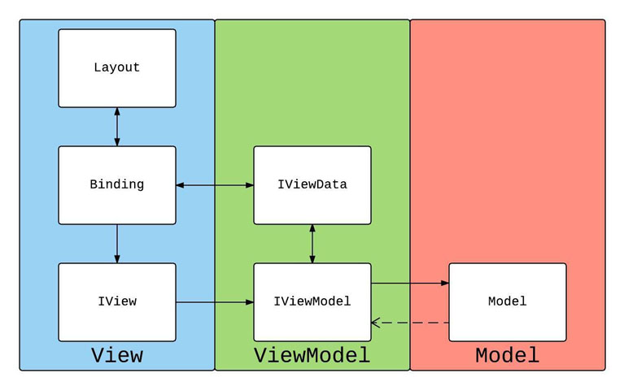
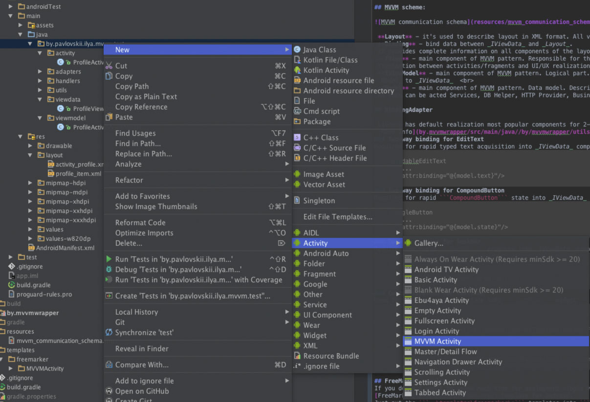

# Android MVVM Wrapper.

Package include more specified features of MVVM pattern for Android platform:

1. Two-way binding</br>
2. More @BindingAdapter and @BindingConversion realization</br>

## MVVM scheme:


 
 **Layout** - it's used to describe layout in XML format. All view components are placed here.<br>
 **Binding** - bind data between _IViewData_ and _Layout_. 
 It provides complete information on all components of the layout for View. <br>
 **IView** - main component of MVVM pattern. Responsible for the visual component. All animations, 
 transaction between activities/fragments and UI/UX realization processed by this component.<br> 
 **IViewModel** - main component of MVVM pattern. Logical part. Receive and processing data from 
 _Model_ to _IViewData_  <br> 
 **Model** - main component of MVVM pattern. Data model. Describe fundamentals data for application.
 As then can be acted Services, DB Helper, HTTP Provider, Business logic e.t.c<br>
 
## BindingAdapter
 
 Library has default realization most popular components for 2-way binding. 
 [More info](by.mvvmwrapper/src/main/java//by/mvvmwrapper/utils/binding/BindingAdapterHelper.java).
### Two-way binding for EditText 
Required for rapid typed text acquisition into _IViewData_ component
```
    <BindableEditText
        ...
        attr:binding="@{model.text}"/> 
```
### Two-way binding for CompoundButton
Required for rapid ```CompoundButton``` state into _IViewData_ component
```
    <ToggleButton
        ...
        attr:binding="@{model.state}"/> 
```
### Two-way binding for SeekBar
Required for rapid ```SeekBar``` progress into _IViewData_ component
```
    <SeekBar
        ...
        attr:binding="@{model.progress}"/> 
```
### Custom typeface for TextView
Used for binding custom typeface into ```TextView``` widget
```
    <TextView
            ...
            attr:assetTypeface="@{model.pathToTypefaceInAssetsFolder}"/>
            <!--or-->
    <TextView
            ...
            attr:fileTypeface="@{model.pathToTypefaceFileOrTypefaceFile}"/>
```

## FreeMarker template
If you doesn't wan't to spend much time for deployment single view into your project, you can use
[FreeMarker](http://freemarker.org/) template for android.
Just put the ```..\templates\freemarker\*``` templates into ```..\AndroidStudioFolder\plugins\android\lib\templates\*```



 
Created on the basis of [Fabio Collini tutorial](https://medium.com/@fabioCollini/android-data-binding-f9f9d3afc761).
